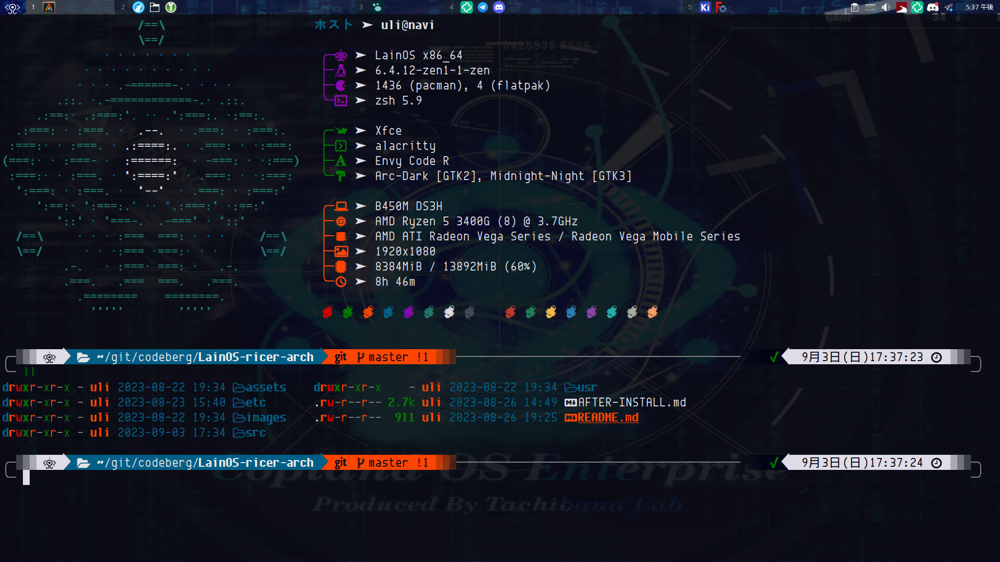
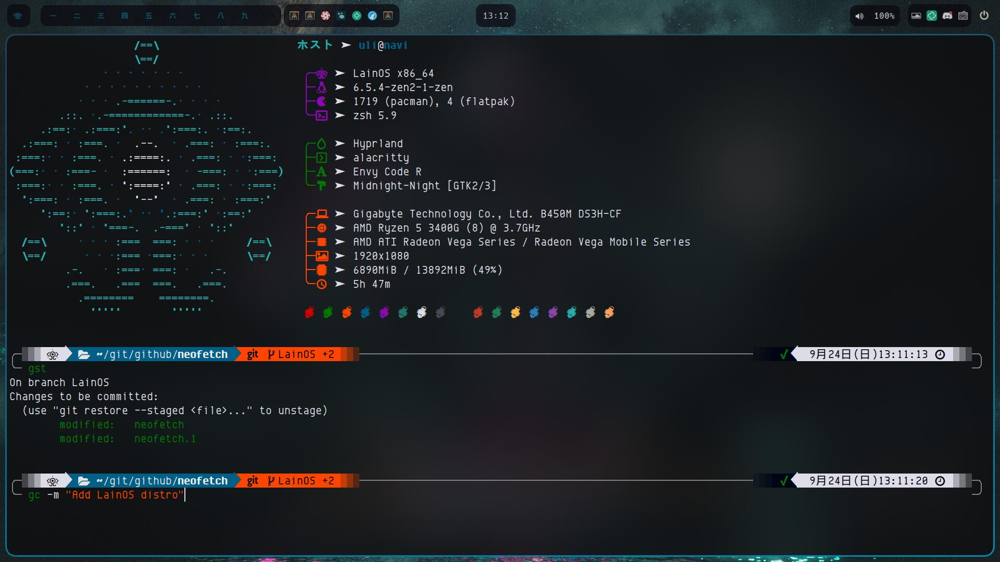

<!--toc:start-->
- [Objective](#objective)
- [Openbox](#openbox)
- [Hyprland](#hyprland)
- [More projects](#more-projects)
  - [LainOS ricer for MX Linux fluxbox](#lainos-ricer-for-mx-linux-fluxbox)
  - [PDL](#pdl)
  - [PDLP](#pdlp)
<!--toc:end-->
---

## Objective

The main purpose of these script is to provide customization of an fresh `Arch` installation to convert it into `LainOS`. Manual intervention could be needed.

This effort precede the creation of a iso image installer with a build script.

In support of the *Arch way* to install Arch Linux here are 2 [install guides](install_guides) to install it and then use the `Lain-ricer-arch.sh` script to rice it.

## Openbox

## Hyprland

## More projects

Other projects from the LainOS team

### LainOS ricer for MX Linux fluxbox

[Ricer script](https://codeberg.org/LainOS/LainOS-ricer) to customize MX Linux fluxbox to LainOS.

### PDL

[PDL](https://github.com/ashk123/PDL) is a small tool for downloading and installing packages.

### PDLP

[PDL Packages](https://github.com/ashk123/PDLP) from users.
